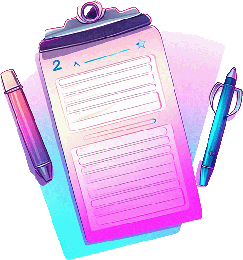
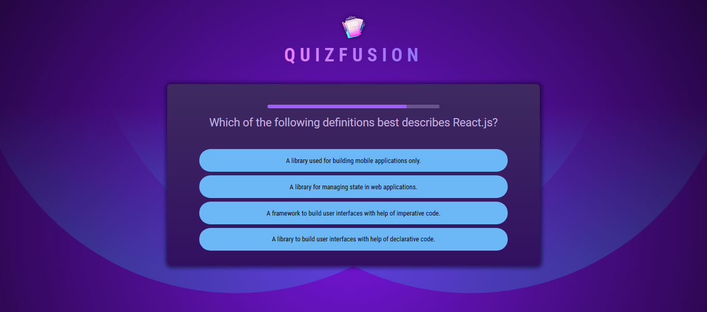
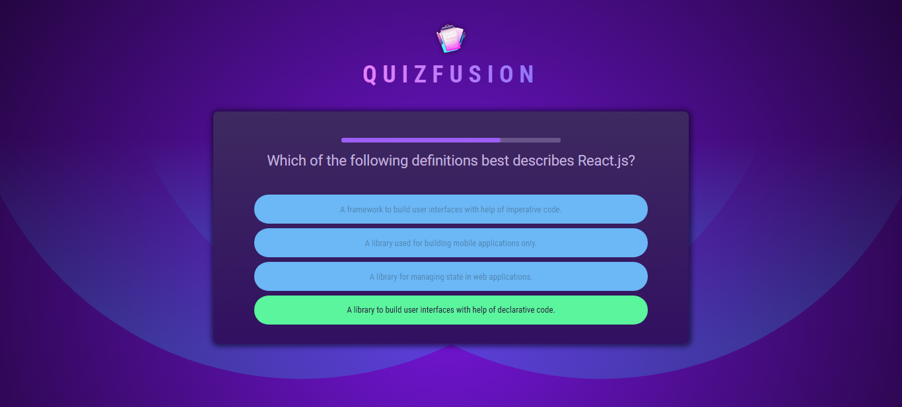
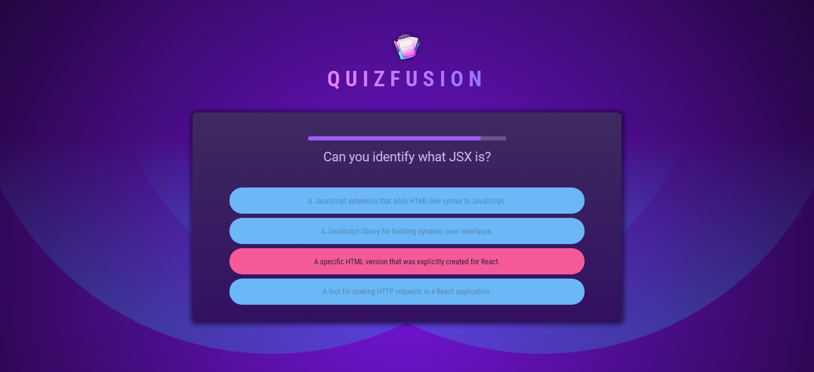
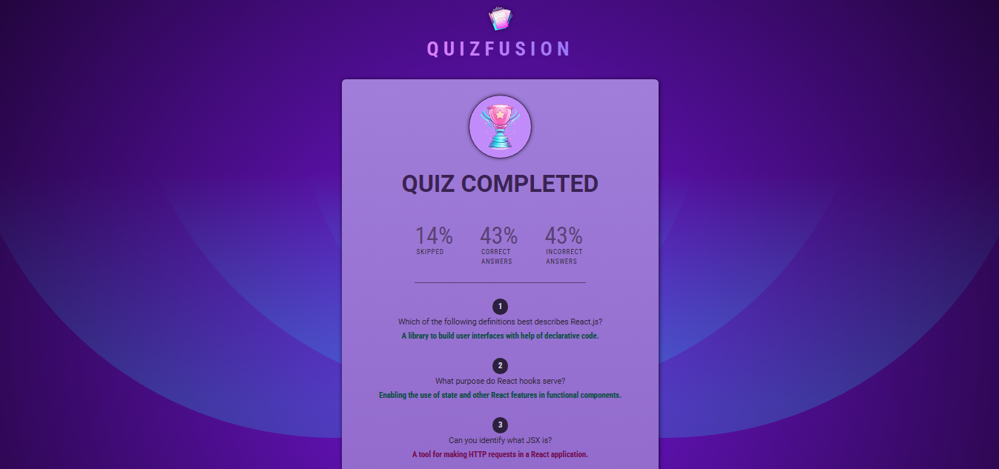

<div id="top"></div>

[](https://react.dev/)


<!-- PROJECT LOGO -->
<br />
<div align="center">
  <a href="https://quizfusion-ddf8e.web.app/">
    
  </a>
  <h1 align="center">QuizFusion</h1>

  <p align="center">
    <a href="https://quizfusion-ddf8e.web.app/">View Demo</a>
    ·
    <a href="https://github.com/SalahShallapy/QuizFusion/issues">Report Bug</a>
  </p>
</div>

QuizFusion is an engaging and interactive quiz application designed to test knowledge while providing detailed feedback. It combines real-time timers, shuffled answer options, and performance summaries for an enjoyable and educational experience.

## Project Overview

### overview



### Correct Answer Preview



### Wrong Answer Preview



### Summary Preview



## Features

- **Dynamic Timer**: Each question comes with a countdown timer, creating a sense of urgency and excitement.
- **Shuffled Answers**: Ensures that answer options appear in random order to prevent memorization.
- **Interactive UI**: Responsive and accessible interface for seamless user interaction.
- **Performance Summary**: Get detailed insights into your quiz performance, including skipped, correct, and incorrect answers.
- **Progressive Navigation**: Move through the questions or skip them as you prefer.
- **Real-Time Feedback**: Answers are validated in real-time, indicating whether they are correct, wrong, or unanswered.

## How It Works

1. Start the quiz by answering the questions presented.

2. Select your answer or skip if unsure.

3. Watch the timer to ensure timely responses.

4. Complete the quiz and view your performance summary, including detailed statistics on skipped, correct, and incorrect answers.

## Project Structure

```
QuizFusion
│      .gitignore
│      .vite.config
│      index.html
│      package-lock.json
│      package.json
│      README.md
│
│
└───public
│   correctAnswer.png
│   logo.png
│   wrongAnswer.png
│   overview.png
│   summary.png
│
└───src
    │   App.jsx
    │   index.jsx
    │   index.css
    │   questions.js
    │
    ├───assets
    │      quiz-compelete.jpg
    │      quiz.logo.jpg
    │
    ├───components
    │      Answers.jsx
    │      Header.jsx
    │      Questions.jsx
    │      QuestionTimer.jsx
    │      Quiz.jsx
    │      Summary.jsx
    │
```

## Installation

To get started with the project locally:

1. Clone the repository:
   ```bash
   git clone https://github.com/SalahShallapy/QuizFusion.git
   ```
2. Navigate to the project directory:
   ```bash
   cd QuizFusion
   ```
3. Install dependencies:
   ```bash
   npm install
   ```
4. Run the project:

   ```bash
   npm run dev
   ```

## Contributing

Contributions are what make the open source community such an amazing place to learn, inspire, and create. Any contributions you make are **greatly appreciated**.

If you have a suggestion that would make this better, please fork the repo and create a pull request. You can also simply open an issue with the tag "enhancement".
Don't forget to give the project a star! Thanks!

1.  Fork the Project
2.  Create your Feature Branch (`git checkout -b feature/AmazingFeature`)
3.  Commit your Changes (`git commit -m 'Add some AmazingFeature'`)
4.  Push to the Branch (`git push origin feature/AmazingFeature`)
5.  Open a Pull Request

   <p align="right">(<a href="#top">back to top</a>)</p>
